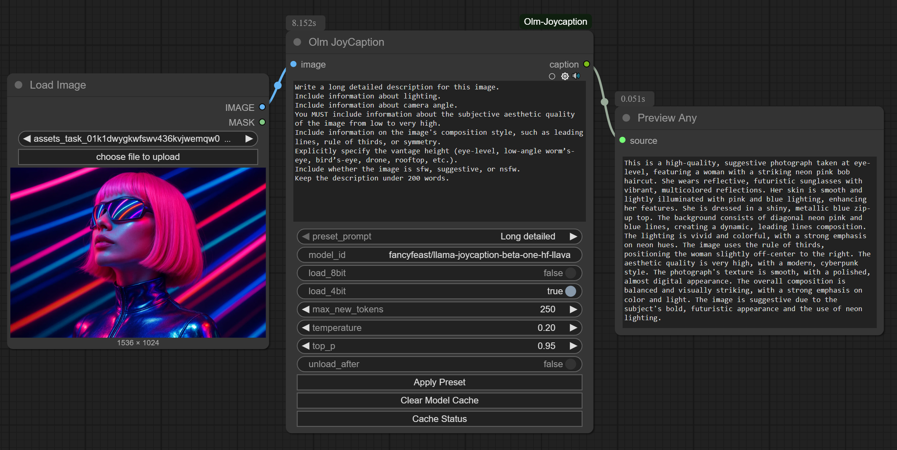
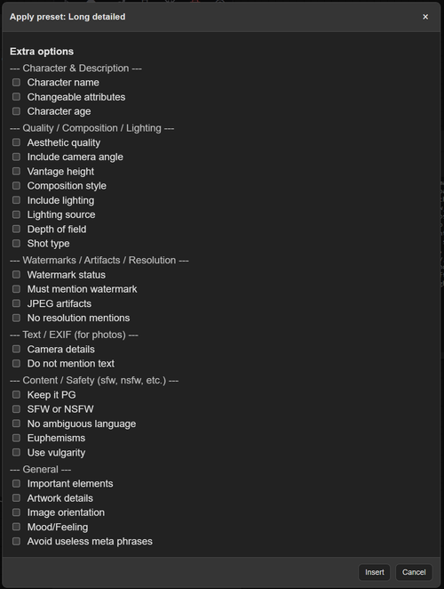

# Olm JoyCaption for ComfyUI



An advanced image captioning node for ComfyUI, powered by JoyCaption - an open, free, and uncensored Visual Language Model (VLM).
Designed for flexible and transparent workflows: no hidden prompts, full quantization support, and editable presets/extras.

- Author: Olli Sorjonen
- GitHub: https://github.com/o-l-l-i
- X: https://x.com/Olmirad

## 📖 What Is This?

Olm JoyCaption is a captioning node for ComfyUI that integrates JoyCaption Beta One (LLaVA variant) directly into the workflow.

The main focus is in composability of the captioning prompt, so you see exactly what you will get, can also easily edit the prompt within the node.

It generates detailed image descriptions, structured prompts, or booru-style tags depending on how you guide it.

Link to the official Joycaption repository:
https://github.com/fpgaminer/joycaption

*Note: Only after I created this custom node, I found out that the original author had also made a [ComfyUI node implementation](https://github.com/fpgaminer/joycaption_comfyui/) a while ago... So you might be better off using it. But I made this for my own use-cases, and this one (my subjective view) has more flexible way of composing prompts.*

## Key points:

- ⚡ Runs JoyCaption natively in ComfyUI, no external apps required.
- 🎚️ Supports 4-bit and 8-bit quantization via bitsandbytes for reduced VRAM usage.
- 🧹 Includes VRAM management: optional auto-unload after each run, plus manual clear/status buttons.
- 📝 Ships with a set of prompt presets and extras, closely following the original JoyCaption repo, just grouped a bit differently.
- 🔧 Prompts/extras are editable (prompts.txt and extras.txt), so users can extend or customize them freely.

## 🖼️ VRAM Requirements

From the official JoyCaption repo:

- bfloat16 full precision: ~17 GB VRAM (comfortable on 24 GB+ GPUs).
- 8-bit quantization: lighter, runs on smaller GPUs.
- 4-bit quantization: even more compact, at some quality/performance trade-off.

This node exposes quantization as simple toggles.

## 📥 Model Download & Cache

The JoyCaption model is downloaded automatically on first use via HuggingFace’s transformers.
By default it is cached under your user directory, e.g.:

```Bash
Linux/macOS: ~/.cache/huggingface/hub/
```

```Bash
Windows: C:\Users\<you>\.cache\huggingface\hub\
```

Subsequent runs will reuse the cached model (no re-download).

## 🎛️ Caption Modes

JoyCaption understands multiple modes of captioning — just pick or write the right prompt.

Presets include categories such as:

- Descriptive — long, formal or casual captions.
- Straightforward — concise, objective, detail-oriented.
- Stable Diffusion Prompt — natural language + tag-like style.
- MidJourney Prompt — training-prompt style outputs.
- Booru Tag Lists — Danbooru / e621 / Rule34 / generic booru-like tags.
- Art Critic — composition, style, symbolism analysis.
- Product / Social Media — marketing-style captions.

Each preset is editable before execution; nothing is hidden.

See the original model repository for detailed list of the captioning prompts.

## 🧩 Extras

When selecting a preset, you can also apply extras that refine the output.
These cover quality, composition, metadata, and safety toggles. Examples:

- Include lighting, camera angle, depth of field, composition style.
- Aesthetic quality, JPEG artifacts, watermark status.
- Camera details (aperture, shutter speed, ISO) for photos.
- No text mention, no resolution mention, no ambiguous language.
- Mark as SFW/suggestive/NSFW.

These are maintained in extras.txt and can be extended easily.



## 📦 Installation

Clone or download this repo into your custom_nodes folder:

git clone https://github.com/o-l-l-i/ComfyUI-Olm-JoyCaption.git


Structure:

```Bash
ComfyUI/
└── custom_nodes/
    └── ComfyUI-Olm-JoyCaption/
        ├── web (frontend files here)
        ├── __init__.py
        ├── ... other files ...
        ├── olm_joycaption.py
        ├── prompts.txt (default prompts)
        └── extras.txt (default extras)
```

Restart ComfyUI after installing.

Dependencies:

- transformers (HuggingFace)
- bitsandbytes (for 4-bit / 8-bit quantization)

## 🚀 Basic Usage

1. Add Olm JoyCaption to your graph.
2. Connect an IMAGE input.
3. (Optional) Pick a preset prompt from the dropdown, then click Apply Preset to paste it into the text box.
4. (Optional) Enable extras to refine the prompt.
5. Connect to Preview Any to see text output.
6. Run the graph. The generated caption is returned as a string and can be piped into Preview Any, or any text-consuming nodes.
7. Use Clear Model Cache or the unload_after toggle to remove the model from VRAM.

## 🧪 Notes

- Preset prompts and extras are user-editable (prompts.txt and extras.txt).
- JoyCaption supports free-form prompts: you’re not limited to presets.
- For smaller GPUs, start with 4-bit quantization.
- The companion Olm Text Display node is included for quick inspection without needing third-party nodes.

## ⚠️ Known Issues

- First load of a model may take time (large weights).
- VRAM usage is still significant even with quantization on GPUs under 12 GB.
- It's best to clear VRAM instantly after use, otherwise you will most likely run into memory issues.
- Outputs can be highly variable depending on prompt wording.
- The ordering of extras can't be done via the GUI editor yet, I might implement that later if I need such feature.

## License & Usage Terms

Copyright (c) 2025 Olli Sorjonen

This project is source-available, but not open-source under a standard open-source license, and not freeware.
You may use and experiment with it freely, and any results you create with it are yours to use however you like.

However:

Redistribution, resale, rebranding, or claiming authorship of this code or extension is strictly prohibited without explicit written permission.

Use at your own risk. No warranties or guarantees are provided.
The only official repository for this project is: 👉 https://github.com/o-l-l-i/ComfyUI-Olm-JoyCaption

## Author

Created by [@o-l-l-i](https://github.com/o-l-l-i)