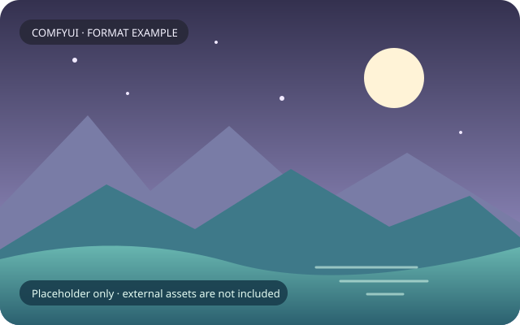

# 外部大资源：只有样例，不含权重或真实预览

- `preview.example.svg`：仓库原生绘制的中性风景占位图，只用于文档展示。无外链、脚本、嵌入照片或真实资料。
- `asset-record.example.json`：权重与媒体登记格式，文件名是虚构示例；`null` 摘要表示未测，不能当作下载/校验成功。
- `locations.json`：相对运行根的目录映射与用途。不使用本机盘符、用户名或临时路径。
- [`annotations.example.json`](annotations.example.json)：一个虚构 Tag 记录的两来源图片、原图/缩略图与主预览标注，以及源网页/Word 输入、可变缓存、训练图/同名 caption 的成组保存样例。它是文档格式示例，不是任何生产加载器或导入器的接口契约。

SVG 不是模型，不要改扩展名伪装为 `.safetensors`，也不要把此 SVG 直接接进仅支持位图的生产预览加载器。真实预览使用现有 PNG/JPEG/WebP 等格式，原文件名和资料绑定必须一起迁移。

资源放置方法、模型伴随配置和 GitHub 边界见 [外部资源维护](../../docs/EXTERNAL_ASSETS.md)。此目录不自动下载、不生成成人样例、不改工作流模型选择。

## 标注样例怎么读

`runtime_root` 和 `external_root` 是位置角色，不是某台机器的绝对路径；实际根、缓存位置和资源指纹只登记到本地仓外清单。图片 `record_id`、`source_id`、`image_id` 演示身份关系，`main_preview` 演示一个主预览与保留第二来源图的区别；缩略图路径不能替代原图备份。训练样例以同名 `.png` / `.txt` 表达配对，以视角、服装和审核状态表达标注。

所有路径、身份和 caption 均为虚构，示例中未提供 PNG、JPEG、HTML、DOCX、数据库或训练图 payload。`null` 大小/哈希不表示已验证。缓存可重建性应由匹配版本的插件单独确认；SQLite 用一致备份，保留原件和媒体绑定，不能凭本样例清理、覆盖或公开缓存。缺少原始输入时，示例只帮助理解格式，不能恢复真实资料。

## 更新记录

- 2026-10-06：补充多来源图片绑定、源输入、缓存和训练图/caption 的虚构标注例子；继续只提供中性 SVG 视觉占位图，不生成真实资源或假模型。
