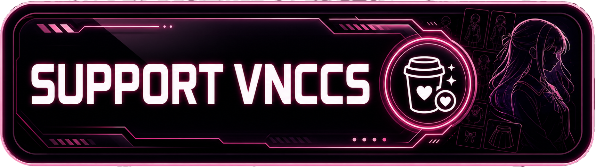
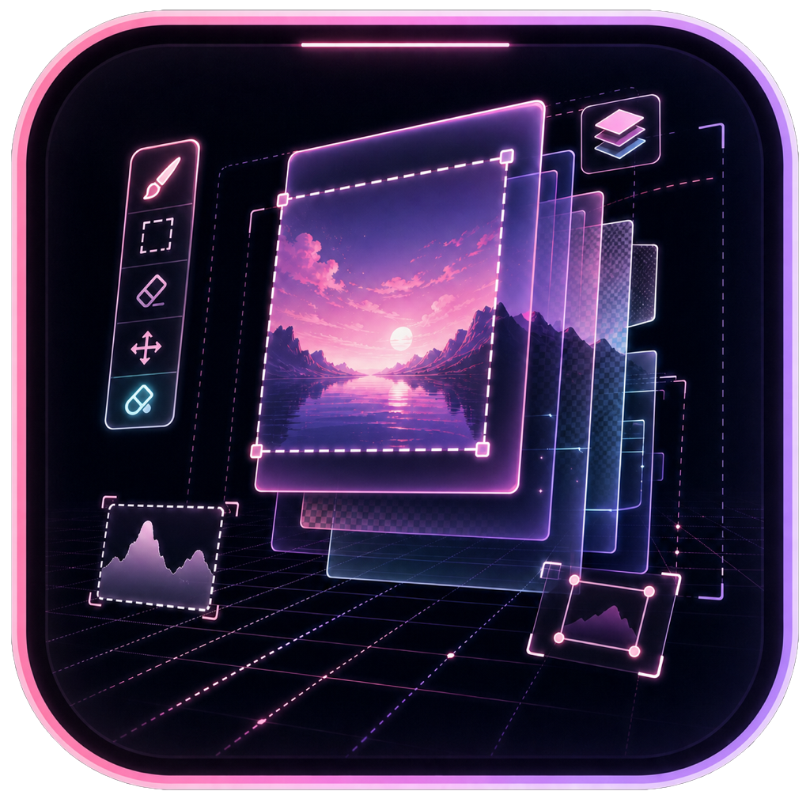
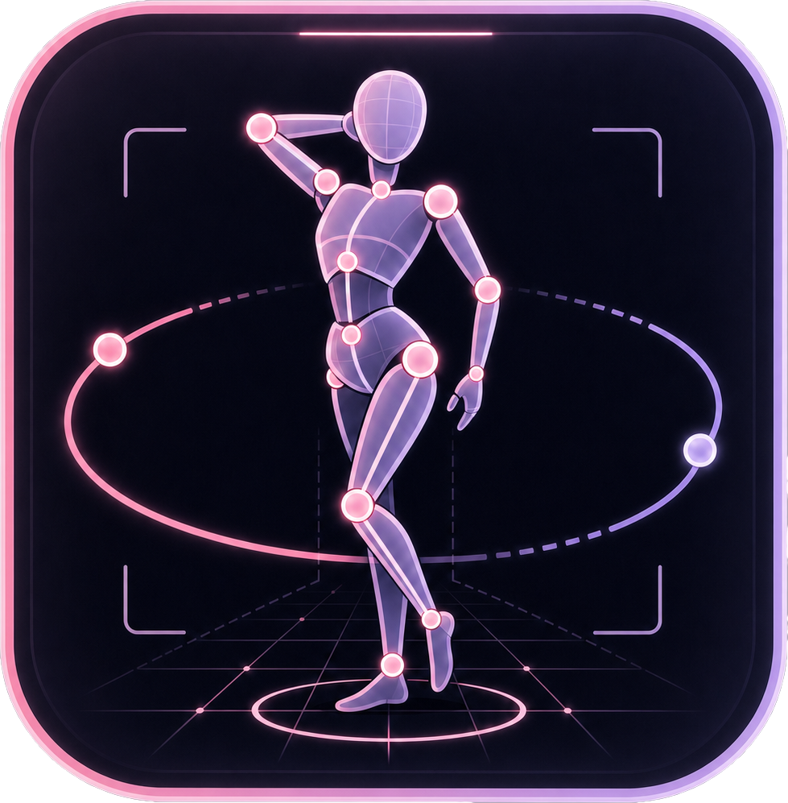

# ComfyUI VNCCS Utils

A collection of utility nodes from the [VNCCS](https://github.com/AHEKOT/ComfyUI_VNCCS) project for everyday ComfyUI workflows, including **VNCCS UniCanvas**, **VNCCS Pose Studio**, and supporting generation utilities.

<table>
<tr>
<td width="50%" align="center">
<strong>Join The Community</strong><br>
Share results, ask questions, and follow VNCCS updates.<br><br>
<a href="https://discord.com/invite/9Dacp4wvQw" target="_blank"></a>
</td>
<td width="50%" align="center">
<strong>Support VNCCS</strong><br>
VNCCS is developed independently. Support helps keep the project moving.<br><br>
<a href="https://www.buymeacoffee.com/MIUProject" target="_blank"></a>
</td>
</tr>
</table>

---

## VNCCS UniCanvas

<p align="center">
  
</p>

**VNCCS UniCanvas** is an integrated infinite-canvas image generation and editing workspace inside ComfyUI. It is designed for freeform creative work: generate anywhere, edit any region, build results across layers, and keep refining without being locked to a single fixed image boundary.

### Key Features

*   **Infinite Canvas Workflow**: Work beyond a single image frame and place generations wherever the composition needs them.
*   **Layer-Based Editing**: Build images from separate raster and mask layers with visibility, opacity, selection, movement, and compositing controls.
*   **Generation Anywhere**: Use a selected region as the generation target for new images, image edits, inpaint, outpaint, and full-area transformations.
*   **Mask and Object Tools**: Paint masks, refine selections, and use SAM-powered object selection to isolate or remove parts of an image.
*   **Preset and Custom Models**: Switch between built-in presets or use manual model selection for supported generation backends.
*   **Turbo and LoRA Controls**: Use Turbo LoRA cards and a general LoRA Stack directly from the generation panel.
*   **Canvas Editing Tools**: Move, transform, resize, snap, undo/redo, and manage generation results without leaving the node.
*   **Progress and Result Handling**: Track generation progress and apply results back into the canvas as editable layers.

## VNCCS Pose Studio

<p align="center">
  
</p>

**Example Workflows:** [QWEN](workflows/VNCCS_Utils%20Pose%20Studio%20QWEN.json) · [Klein9b](workflows/VNCCS_Utils%20Pose%20Studio%20Klein9b.json)

**VNCCS Pose Studio** is a professional 3D posing, framing, lighting, and pose-library environment running directly inside a ComfyUI node. It is designed for building high-quality pose/control references without leaving the graph: adjust the character body, pose bones interactively, frame the camera, tune lights, manage saved poses, and output single images or pose batches.

### Key Features

*   **Interactive 3D Viewport**: Pose the mannequin directly in the node with selectable joints, bone manipulation, transform controls, and full **Undo/Redo** support.
*   **Dynamic Body Generator**: Fine-tune the character shape with sliders for Age, Gender blending, Weight, Muscle, and Height.
*   **Multi-Pose Tabs**: Create multiple independent pose states inside one node, making batch outputs and pose sequences easier to build.
*   **Pose Copy/Paste**: Transfer complex poses between tabs without rebuilding them from scratch.
*   **Modal Pose Gallery**: Save, browse, load, and delete poses in a focused full-screen gallery instead of cluttering the main workspace.
*   **Pose Import/Export**: Batch save and load pose data via JSON for reuse across workflows or projects.
*   **Tracing Support**: Load a background reference image and align the 3D character to it for accurate pose matching.
*   **Precision Camera Controls**: Set output dimensions, zoom, model rotation, and camera orbit with an integrated radar-style control.
*   **Viewport Frame Preview**: Preview the final render boundary directly in the viewport so composition matches the output.
*   **Advanced Environment Lighting**: Control Ambient, Directional, and Point Lights, including 2D radar controls for positioning point lights and radius controls for their influence.
*   **Keep Original Lighting Mode**: Bypass synthetic lighting for clean flat renders, useful for ControlNet-style pose/reference outputs.
*   **Prompt-Aware Lighting Output**: Generate descriptive lighting prompts that can be combined with your scene prompt.
*   **Custom Prompt Templates**: Use tag-based templates such as `<lighting>` and `<user_prompt>` to control how the final prompt is assembled.
*   **Direct Sidebar Prompting**: Add scene details in an auto-expanding prompt field directly inside the Pose Studio UI.
*   **Flexible Export Modes**: Output poses as a list or as a grid, with configurable background color.

👉 **[Detailed Usage Guide](docs/VNCCS_POSE_STUDIO_USAGE.md)**

## Additional Nodes

### VNCCS Visual Camera Control
**[Example Workflow](workflows/VNCCS_Utils%20Visual%20camera%20control%20node%20for%20Qwen-Image-Edit-2511-Multiple-Angles%20LoRa.json)**

An interactive node with a visual widget for controlling camera position. It is designed for intuitive angle control and prompt generation, especially for multi-angle LoRAs like **Qwen-Image-Edit-2511-Multiple-Angles**.

*   **Visual Widget**: Select azimuth and distance with the mouse.
*   **Elevation Slider**: Pick elevation from -30° to 60°.
*   **Trigger Word Toggle**: Enable or disable the `<sks>` trigger from the widget.

### VNCCS QWEN Detailer
**[Example Workflow](workflows/VNCCS_Utils%20QwenDetailer_ChangeEmotion.json)**

A QWEN-Image-Edit2511 detailer for enhancing detected regions such as faces, hands, and objects with vision-guided instructions.

*   **Smart Cropping**: Automatically squares crops and handles padding.
*   **Vision-Guided Enhancement**: Uses QWEN-generated instructions or user prompts.
*   **Drift Fix**: Helps keep the enhanced area aligned with the original composition.
*   **Quality of Life Tools**: Includes color matching, Poisson blending, and upscaling options.
*   **Inpainting Mode**: Supports mask-based editing and filling black areas.
*   **QWEN Options**: Supports QWEN-Image-Edit2511-specific options such as `distortion_fix` and `qwen_2511` mode.

### VNCCS Model Manager & Selector
**[Example Workflow](workflows/VNCCS_Utils%20Model%20Loader%20ShowCase.json)**

A system for managing and selecting LoRAs and checkpoints directly in ComfyUI, with support for Civitai and HuggingFace.

#### VNCCS Model Manager
The backend node that reads a HuggingFace-hosted `model_updater.json` and manages model downloads.

*   **Repo ID**: Point the manager to your HuggingFace model repository.
*   **Downloads**: Queue and download models in the background.
*   **Civitai Support**: Use API key authentication for restricted Civitai models.

👉 **[Configuration Guide: How to create your own model repo](docs/MODEL_MANAGER_GUIDE.md)**

#### VNCCS Model Selector
The companion UI node for choosing models from the configured repository.

*   **Visual Card UI**: Shows model name, version, status, and description.
*   **Smart Search**: Opens a searchable modal model list.
*   **Status Indicators**: Shows Installed, Update Available, Missing, and Downloading states.
*   **One-Click Install/Update**: Install or update models directly from the selector.
*   **Universal Connection**: Outputs a standard relative path string compatible with standard ComfyUI nodes.

👉 **[Usage Guide: How to use Selector with Standard Loaders](docs/MODEL_SELECTOR_USAGE.md)**

### VNCCS BBox Extractor

A helper node for extracting and visualizing crops when you need detected bounding-box regions without running a full face/detailer workflow.

## Installation

### Recommended: ComfyUI Manager

1. Open **ComfyUI Manager**.
2. Choose **Custom Nodes Manager**.
3. Search for **VNCCS Utils**.
4. Click **Install**.
5. Restart ComfyUI.

### Manual Installation

Open a terminal in your ComfyUI directory and run:

```bash
cd ComfyUI/custom_nodes
git clone https://github.com/AHEKOT/ComfyUI_VNCCS_Utils.git
cd ComfyUI_VNCCS_Utils
pip install -r requirements.txt
```

Restart ComfyUI after installation.

## Star History

<a href="https://www.star-history.com/?repos=AHEKOT%2FComfyUI_VNCCS_Utils%2CAHEKOT%2FComfyUI_VNCCS%2CAHEKOT%2FComfyUI_HYWorld2&type=timeline&legend=top-left">
 <picture>
   <source media="(prefers-color-scheme: dark)" srcset="https://api.star-history.com/chart?repos=AHEKOT/ComfyUI_VNCCS_Utils%2CAHEKOT/ComfyUI_VNCCS%2CAHEKOT/ComfyUI_HYWorld2&type=timeline&theme=dark&legend=top-left" />
   <source media="(prefers-color-scheme: light)" srcset="https://api.star-history.com/chart?repos=AHEKOT/ComfyUI_VNCCS_Utils%2CAHEKOT/ComfyUI_VNCCS%2CAHEKOT/ComfyUI_HYWorld2&type=timeline&legend=top-left" />
   
 </picture>
</a>
