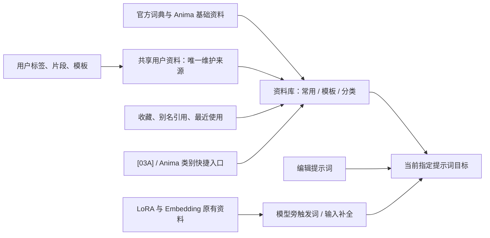

> 实施状态更新（2026-09-10）：S1–S7 已完成受控正式交付。本文设计和初始状态作为历史依据；最终验收、复核口径及限制见 [交付总览](G:/ComfyUI-aki-v3/benchmark_reports/2026-09-07_prompt_library_integration/交付总览.md) 和 [S7正式交付](G:/ComfyUI-aki-v3/benchmark_reports/2026-09-07_prompt_library_integration/S7_正式交付.md)。

# 提示词资料库整合、职责划分与去重：完整实施计划

版本：V2.1；编制日期：2026-09-07；工作区：`G:\ComfyUI-aki-v3`。本次修订目标：**归一化、统一标准、精简化**。

当前状态：**计划编制与只读核查。本轮不实施，不迁移词条，不修改插件或工作流，不创建定时任务。** 下文所有功能、数据和发布交付均为后续实施要求，不能视为已经完成。

本文件取代旧计划中“所有提示词相关插件和完整生成链路都要整合”的范围。以用户最新界定为准：主做 WeiLin、共享库、Anima、[03A] 的资料库整理，以及 LoRA 触发词、Embedding 与指定补全功能的职责和去重。

配套文件：[交互与数据验收用例](G:/ComfyUI-aki-v3/production_tools/提示词资料库整合_验收用例.md)、[阶段交付与执行看板](G:/ComfyUI-aki-v3/production_tools/提示词资料库整合_阶段交付.md)。

## 1. 项目目的：完成后具体解决什么

核心结果是：**资料身份和分类归一，字段与动作统一，日常入口和操作精简；同一内容只维护一次，选择、编辑和补全不互相覆盖或重复插入。**

| 当前要解决的问题 | 目标行为 | 交付凭据 |
|---|---|---|
| WeiLin 内部库、共享库、Anima 和模板入口看起来都有“词库”，无法判断是否是同一份资料 | 每个数据源标明唯一维护者；入口显示其读取范围与保存去向 | 来源台账、读写责任表、同条目跨入口演示 |
| 条目可能重名、同文异名、重复归类，旧导出或缓存又被当作新库 | 确认的重复只有一个规范身份；变体保留区别；历史文件不自动成为活跃库 | 合并前后对照、逐条去向、来源映射 |
| 完整模板与角色/服装等局部片段混用 | 模板入口选整段；专用选择器选局部；按类型和模型筛选 | 分类字典、视图规则、分类审查记录 |
| 编辑器、模板和选择器职责重叠，用户不知道在哪里改才能全局生效 | 一个主要管理入口，多个按用途选择的入口；“修改资料”和“修改本次提示词”明确分开 | 操作说明、编辑回写与重开记录 |
| LoRA 触发词和 Embedding 容易被当作普通标签合并或自动删除 | 保留资源绑定与原始语法；只处理有来源依据的重复 | 模型关联表、手写保留和模型切换用例 |
| 多套补全可能抢键盘、弹出重复候选，或刚改的词无法搜到 | 同一输入上下文只由一个补全界面响应；候选来源清楚、更新可验证 | 补全职责表、冲突与缓存测试 |
| 过去交付只说“融合完成”，缺少可审查的阶段结果 | 每阶段提供产物、通过证据、未决问题和下一步；发布有可恢复基线 | S1–S7 阶段包与最终验收结论 |

不设置“必须减少多少百分比词条”这类指标。词条数量减少不等于质量提高；**无损、可找到、职责明确、操作可靠**才是衡量依据。

### 1.1 V2.1 修订决策

| 目标 | 选定修改 | 明确验收点 |
|---|---|---|
| 归一化 | 相同资料归到稳定身份和统一分类；正文、用途、资源绑定分别保留 | 规范身份可追溯，名称/类名变化不丢引用，变体不误并 |
| 统一标准 | 固定字段含义、类名、按钮动词、目标绑定、排序和状态反馈 | 同一功能在范围内入口用同一名称；同名动作不产生不同副作用 |
| 精简化 | 提示词区默认只保留“资料库”“编辑提示词”两个常驻功能入口 | 独立资料管理入口1个；同义重复按钮0组；常用选词无需辨认插件 |
| 减少操作 | 模板/分类使用同一资料任务的快捷视图；一次选择后明确插入 | 普通插入不多一次确认；一个选用任务最多一个活跃选择弹层 |
| 控制复杂度 | 用现有库和必要适配实现统一；来源和版本在详情展开 | 不新增平行管理器、独立收藏正文库、全局补全框架或多槽拼装系统 |

保留七个内部质量阶段；对用户按四个成果包展示，见第10节。精简的是重复概念、重复维护和重复操作，不省略数据保护与核心验收。

## 2. 范围与边界

### 2.1 本次纳入

| 编号 | 对象 | 本次负责的内容 | 主要产物 |
|---|---|---|---|
| I01 | WeiLin 编辑器内提示词资料库 | 用户词条、分组、别名、收藏/引用关系、与共享库的重复内容；其标签补全 | 内部库到共享目录的字段和来源映射；编辑职责 |
| I02 | 公用共享提示词库 | 活跃库、分类、片段、完整模板、预览引用、共享读写 | 规范用户库候选、去重分类结果、版本与恢复方案 |
| I03 | Anima 提示词库与选择器 | 角色、服装、动作/姿势、背景等实际存在的库、用户扩展、收藏、共享视图 | 官方/用户/共享分界、分类路由、收藏兼容 |
| I04 | UAP `[03A] 提示词模板` | 模板资料、选择状态、应用方式、与共享库身份关系 | 模板职责、唯一应用路径与保存重开验证 |
| I05 | LoRA Manager 触发词 | 触发词来源、资源绑定、用户覆盖、插入方式和重复处理 | 模型关联契约、触发词引用/插入验收 |
| I06 | Embedding 输入与补全 | 资源身份、可用性、展示名称、插入语法、同名消歧、候选重复 | 资源索引与补全兼容规则 |
| I07 | WeiLin 与 custom-scripts 自动补全 | 自定义词表、基础词典、候选展示、词表复用、响应范围与快捷键 | 补全分工、用户词表映射、交互验收 |

I05/I06 只涉及提示词资料及输入。LoRA 配方、模型下载、模型整理、训练、加载器重构等不纳入。

### 2.2 明确不整合

`prompt-assistant`、Danbooru 图库与浏览器导入、WD14、JoyCaption、TB 反推、翻译/LLM 工具、PromptCleaningMaid、通用文本处理、编码器、细化/放大子图、旧 `nsfwprompt` 及其他插件均不迁移资料、不合并功能、不做整体改造。本轮不会把它们的词表、历史或系统模板顺带收进共享库。

允许的必要边界检查只有三种：

1. 范围内入口向现有提示词目标写入是否正确，必要时查看导出的执行输入；不改变编码、采样、细化逻辑。
2. 不在范围内的扩展若与指定补全直接冲突，记录冲突，并优先在范围内限制监听范围；不直接停用整个外部插件。
3. 当前 UAP 常用入口代码位于图库插件的 `js/quick_group_navigation/uap_daily_controls.js`。后续如需修改，仅允许与本项目入口和目标绑定直接有关的部分；这不代表图库业务纳入整合。

不以本项目为理由卸载插件、批量启停插件或重排整个工作流。视觉调整限于本项目常用提示词区与资料管理界面。

## 3. 当前事实与尚待核实的问题

本节是计划依据，不是实施验收结论。当前磁盘文件、源码、过去验收报告和浏览器实时状态必须分开记录。

| 证据级别 | 2026-09-07 核查结果 | 对计划的影响 |
|---|---|---|
| 当前文件 | UAP 保存文件为 308 个主节点、378 条连线、20 个子图定义 | 保持既有工作台结构，不由资料库项目扩展成全工作流改造 |
| 当前文件 | `[03A]` 为 #1055、#1104、#1231，类型 `PromptSelector`，保存的 mode=2，prompt 输出没有连线 | “能选模板”与“当前生成使用了模板”分开验收；先核实前端写入机制 |
| 当前文件 | 三分支的角色/服装/姿势等多个 Anima 选择器输出没有连线；组合器有输出连接 | 不能笼统声称所有选择器沿连线生效；只验证本项目选择后的实际目标 |
| 当前源码 | UAP 已有 WeiLin 编辑、共享预设正/负向目标、Anima 快捷入口和组开关 | 复用常用控制台，避免新增一套平行控制台 |
| 当前源码 | `createPromptInserter` 已检查工作流/分支并做文本比较式重复过滤 | 已有保护应回归；文本比较不等价于资料 ID 去重或模型触发词语义去重 |
| 当前源码/既有实现 | Anima 已有共享库适配、去重与缓存模块；WeiLin 共享库已有分类和分页接口 | 优先补齐现有接口与数据契约，不先造新数据库或全局框架 |
| 历史报告 | 2026-09-07 插件融合报告验证过入口写入、分支隔离和部分重复加载问题 | 作为回归样例，不视为本次全量词库质量已经合格 |
| 尚待实施期验证 | 当前浏览器个人存储、运行中注册状态、实际写入路径、记录的用户/基础来源属性与收藏引用 | S1 必须重新冻结，不能把目录文件数当词条数 |

### 3.1 本轮只读统计的资料规模

下表为本次文件快照统计，不代表全部是用户自建内容，不直接相加作为待合并总量。SQLite 统计在相关 WAL 为空时只读完成；读前后文件大小、修改时间和 WAL 大小未变化。后续实施使用新的持续一致性快照，而不沿用只读统计作为备份。

| 来源及绝对路径 | 本次统计 | 口径及处理含义 |
|---|---:|---|
| `G:\ComfyUI-aki-v3\ComfyUI\custom_nodes\WeiLin-Comfyui-Tools-V52-FullPromptSelector\user_data\userdatas_zh_CN_tags.db` | 244,465 标签；15 主组、488 子组 | 正文唯一值 241,609；2,856 是超出唯一正文数的记录，不等于可直接删除的重复；UUID 全唯一，空正文和按子组 ID 检查的孤儿为 0 |
| `G:\ComfyUI-aki-v3\ComfyUI\custom_nodes\WeiLin-Comfyui-Tools-V52-FullPromptSelector\user_data\userdatas_zh_CN_danbooru.db` | 49,858 条 | 基础补全词典，含译名、热度、别名；保留来源，不全量倒进常用预设 |
| `G:\ComfyUI-aki-v3\ComfyUI\custom_nodes\WeiLin-Comfyui-Tools-V52-FullPromptSelector\user_data\userdatas_zh_CN_history.db` | history 172 行；collect_history 0 行 | 尚未按删除标记区分有效历史；不自动入共享库 |
| `G:\ComfyUI-aki-v3\ComfyUI\custom_nodes\WeiLin-Comfyui-Tools-V52-FullPromptSelector\user_data\prompt_selector\data.json` | 259 分类；16,442 条；ID 全唯一 | 正文唯一值 16,383；59 是待核对的超额记录；template=true 与 favorite=true 都为 0，不能据此推断没有模板或没有其他来源收藏 |
| `G:\ComfyUI-aki-v3\ComfyUI\custom_nodes\comfyui-anima-tools\js\data.js` | 40,600 画师项 | 静态数组解析；基础资料索引，不计为本项目新增用户词条 |
| `G:\ComfyUI-aki-v3\ComfyUI\custom_nodes\comfyui-anima-tools\js\character_data.js` | 8,000 角色 | `character_official_data.json` 的 7,999 键是附加映射，不能再加为独立角色数 |
| `G:\ComfyUI-aki-v3\ComfyUI\custom_nodes\comfyui-anima-tools\js\clothing_data.js`、`pose_data.js`、`background_data.js`（同目录） | 430 服装；297 姿势；1,087 背景 | 含双语名、分类和预览等；不能迁移时只保留正文 |
| `G:\ComfyUI-aki-v3\ComfyUI\user\anima_tools_favorites.json` | artist 分区 1 条，其余 6 分区 0 条 | 该结构也可保存自定义内容；本次数字不包含尚未检查的浏览器状态 |
| `G:\ComfyUI-aki-v3\ComfyUI\custom_nodes\comfyui-custom-scripts\user\autocomplete.txt` | 本次未发现文件 | 有该功能不等于已有自定义词库需要迁移；仍须验证空源兼容 |

### 3.2 已发现的设计风险：尚不能当作用户已遭遇的故障

| 风险 | 源码证据 | 计划中的处理 |
|---|---|---|
| 内部 SQLite 与共享 JSON 已互通读取，但不等于编辑同源 | [WeiLin 共享桥](G:/ComfyUI-aki-v3/ComfyUI/custom_nodes/WeiLin-Comfyui-Tools-V52-FullPromptSelector/app/server/prompt_api/prompt_selector_bridge.py:81) | S1 画出所有写入口；S2 决定可共享资料范围，防止承诺已经统一保存 |
| 标签存在多个写入口，部分 INSERT 未显式携带 UUID | [面板标签管理](G:/ComfyUI-aki-v3/ComfyUI/custom_nodes/WeiLin-Comfyui-Tools-V52-FullPromptSelector/app/server/panel_server/tag_manager.py:106) | 验证新增/导入时身份补齐；不能只测试主弹窗 |
| Anima 角色合并按规范化姓名用共享项覆盖本地字段 | [共享资料合并](G:/ComfyUI-aki-v3/ComfyUI/custom_nodes/comfyui-anima-tools/js/anima_shared_prompt_data.js:71) | 同名不同作品/正文保留变体，不以姓名充当唯一身份 |
| Anima 共享分类路由与类别 ID、正文语义校验有关 | [共享条目路由](G:/ComfyUI-aki-v3/ComfyUI/custom_nodes/comfyui-anima-tools/nodes.py:2417) | 改类/改文后同步验证路由台账，防止条目被送入 pending 而在选择器消失 |
| WeiLin 与 LM 都有触发词来源；WeiLin 有文件名/输出名回退 | [WeiLin 触发词](G:/ComfyUI-aki-v3/ComfyUI/custom_nodes/WeiLin-Comfyui-Tools-V52-FullPromptSelector/app/server/prompt_api/trigger_words.py:98)、[LM 触发词读取](G:/ComfyUI-aki-v3/ComfyUI/custom_nodes/comfyui-lora-manager/py/utils/utils.py:11) | LM 为模型关联词主维护入口；推断词显示来源，不能自动覆盖用户确认词 |
| LM 模型词输出有分组分隔符；custom-scripts 也能补全模型资源 | [LM 叠加节点](G:/ComfyUI-aki-v3/ComfyUI/custom_nodes/comfyui-lora-manager/py/nodes/lora_stacker.py:33)、[custom-scripts 补全](G:/ComfyUI-aki-v3/ComfyUI/custom_nodes/comfyui-custom-scripts/web/js/autocompleter.js:531) | 去重保持模型分组/顺序；按输入上下文限定补全处理器 |
| WeiLin 补全缓存命中续期，查询键未见词库版本 | [补全缓存](G:/ComfyUI-aki-v3/ComfyUI/custom_nodes/WeiLin-Comfyui-Tools-V52-FullPromptSelector/js_node/prompt_selector/support/autocomplete_cache.js:243) | 删除/修改词条后持续热查询必须更新，不能把默认两小时当硬刷新保证 |

共享库当前没有统一的来源链、模型范围和内容形式字段；S2 要给出兼容存储和往返证据。[03A] 名为“提示词模板”不代表 16,442 条全部是完整模板，治理前先识别内容类型。

主要证据入口：

- [当前 UAP 工作流](G:/ComfyUI-aki-v3/ComfyUI/user/default/workflows/UAP统一生产工作台_v2.json)。
- [UAP 常用入口及写入保护](G:/ComfyUI-aki-v3/ComfyUI/custom_nodes/ComfyUI-Danbooru-Gallery-V50-GalleryOnly/js/quick_group_navigation/uap_daily_controls.js:49)。
- [PromptSelector 后端定义](G:/ComfyUI-aki-v3/ComfyUI/custom_nodes/WeiLin-Comfyui-Tools-V52-FullPromptSelector/prompt_selector/prompt_selector.py:207)。
- [上次插件融合验收](G:/ComfyUI-aki-v3/benchmark_reports/2026-09-07_plugin_fusion/验收说明.md)。

S1 的证据表必须补齐：数据路径、实际记录数与统计口径、字段、读者、写者、ID/引用规则、浏览器状态、缓存、备份与恢复方法。不存在的数据写“未发现”，尚未核实的数据写“待核实”。

## 4. 目标结构与功能归属

### 4.1 选定方案

采用 **一个用户资料维护中心、一套逻辑资料标准、两个日常功能入口，保留官方词典与模型资料的原来源**。专用选择器是按用途提供的视图，不再表达另一个需要单独维护的库。

默认沿用 WeiLin 的共享库及现有接口承载已整理的用户标签、片段和模板。先证明字段无损，再接入 WeiLin 内部库与 Anima 用户扩展的可共享内容。24 万条 WeiLin 标签的来源属性尚未逐条确认，不预设全是用户自建，也不安排整库搬入共享预设；基础/来源未知部分先保留原文与检索来源。官方大词典、LoRA/Embedding 模型资料和个人使用状态维持各自来源，通过索引、引用和适配关联。

用户需要维护的同一条内容只有一个权威记录；各视图遵守相同的字段与操作标准，保留必要专用能力。通过现有接口和局部适配实现，避免为视觉相似强制重写所有插件界面或存储文件。



图中资料库视图由现有读取接口与适配提供，不预设新建服务；快捷入口按目标与类别打开相应视图，不表达独立资料库。向同一目标写入遵守统一动作标准，不同时新增多条拼装路径。

### 4.2 唯一维护者与编辑规则

| 资料类型 | 默认权威来源 | 可做的操作 | 其他入口的行为 |
|---|---|---|---|
| 整理后的用户标签、片段、模板 | 现有共享用户库 | 新增、编辑、分类、别名、归档 | 读取同一身份；编辑委托同一保存路径，不各存一份 |
| Anima 官方或插件自带基础内容 | 原官方/插件数据文件 | 原来源更新；界面提供“另存为我的资料” | 只读浏览，用户版本保留与原条目的关系，不改坏上游数据 |
| 用户保存的 Anima 自定义内容 | 经无损验证后接入共享用户库；保留旧 ID 映射 | 按内容类型编辑 | 不再把共享导入结果当另一份独立用户内容反复同步 |
| LoRA 触发词与用户覆盖 | LoRA Manager 当前实际使用的模型资料存储 | 在原管理入口修改；共享目录保存引用 | 不复制成脱离模型的普通标签，不由 WeiLin 反向覆盖模型元数据 |
| Embedding | 本地资源登记及现有元数据 | 索引、显示、引用 | 插入目标支持的实际语法；名称相同不能自动认作同资源 |
| 补全基础词典 | 既有词典来源 | 只读检索，按原方式更新 | 不全量灌入常用预设；不把频次当作用户收藏 |
| 补全用户词条 | 用户资料中适合补全的原子词及自定义词表映射 | 通过唯一用户词条来源维护 | 不将完整场景模板拆成候选词 |
| 收藏、最近使用、排序 | 对应用户状态 | 引用规范 ID 或保留兼容映射 | 不复制正文以表达收藏；不得因合并失去收藏 |
| 历史和当前手写文本 | 原历史/工作流存储 | 原行为保留；明确“保存为资料”时才入库 | 不批量当作新词库来源 |

### 4.3 本项目应做和不应做的技术改造

默认只改最小负责层：现有读写适配、共享数据映射、候选去重、目标绑定与界面入口。保持节点类名、必要参数、工作流格式、LoRA/Embedding 加载语法和核心 ComfyUI 逻辑。

数据契约优先复用现有 ID 和字段。缺少的内容类型、来源、版本等先验证是否可以作为兼容字段写入；若旧入口会丢弃未知字段，则在现有适配层保存映射，并把正文仍留在能无损保存的来源，直到通过往返测试。不得先做有损迁移再补字段。

只有当现有格式无法实现必要的无损保存且最小适配已被事实排除时，才形成独立的格式升级设计；该设计必须包含所有读写者、旧数据回读和原子提交策略，不直接在本项目中引入第二套平行维护库。

## 5. 数据盘点、字段与去重规则

### 5.1 盘点单位与最小字段

盘点单位是“来源记录”，不是文件。一个源文件可含多个分类和多条词条；一条规范资料可对应多个来源记录。

来源台账逐项记录：来源 ID、绝对路径/浏览器存储键、源记录 ID、原始分类、原始正文校验、来源角色（活跃/官方/用户/状态/缓存/备份）、实际读写入口、规范资料 ID、处理状态及原因。浏览器存储只导出本项目所需键，不导出无关账户或密钥。

规范资料最小逻辑字段：

| 字段组 | 内容 | 约束 |
|---|---|---|
| 身份 | 稳定 ID、来源与旧 ID 映射 | 不把显示名称或正文哈希单独当作长期 ID；改名/改文不丢收藏 |
| 内容 | 原文、内容类型、显示名 | 原文独立保留，比较用文本不能覆盖原文 |
| 用途 | 主分类、主题标签、正/负向用途、模型适用范围 | “未知适用”与“通用”不同；不得猜测通用 |
| 检索 | 别名、中文名、可检索正文 | 显示翻译不得替换实际插入文本 |
| 管理 | 维护来源、修订号、审核/归档状态 | 可识别旧窗口基于旧版本的覆盖 |
| 扩展 | 预览引用、模型绑定、模板变量、随机规则、用户覆盖关系 | 只对实际存在功能记录，不凭空新增编辑器选项 |

先保留未知字段并建立字段往返对照，再决定是否整合。预览文件只治理已有引用，不在本项目中批量联网下载补图。

### 5.2 三种去重分别执行

1. **资料去重**：多来源记录映射到同一规范资料，解决维护多份的问题。
2. **候选去重**：搜索/补全展示时合并同一可插入候选，保留多来源标记，原数据可保持独立。
3. **操作去重**：重复点击或双事件只写入一次，防止 UI 导致重复；不能清扫用户主动写出的重复词。

三者各有日志与验收，不能拿“界面只显示一条”证明后台资料已经合并。

| 重复/冲突情形 | 默认处理 | 必须保留的内容 |
|---|---|---|
| 原文逐字节一致，内容类型、用途和模型约束相容 | 可自动形成合并候选；复核元数据冲突后合并 | 全部来源、旧 ID、别名、收藏、预览映射 |
| 正文一致但一条正向、一条负向，或模型绑定不同 | 独立保留；可共用检索文本 | 用途、模型关联与独立身份 |
| 只差外部空白/换行 | 仅用于发现候选；确认不涉及有意义格式后处理 | 原始版本和处理理由 |
| 同名异文、不同权重、顺序、大小写或标点语义不同 | 保留变体，加区别名或版本说明 | 原文、模型/用途差异 |
| 同义词、中英名称、近似自然语言模板 | 别名或人工复核，不自动删合 | 插入原文与来源 |
| 一个整段模板包含某局部片段 | 不视为重复条目，不自动拆分 | 模板完整性 |
| 两个模型使用相同触发词 | 保留两个绑定，展示可合并，应用时按来源和顺序判断 | 模型身份和启用状态 |
| 同名 Embedding 位于不同目录/资源不同 | 进行消歧，不任取第一项 | 完整路径或现有资源 ID，实际语法 |
| 备份、默认副本、导出或缓存重复活跃库 | 登记来源角色，不再次发布 | 原始文件和校验 |
| 空记录、损坏记录、未知结构 | 原样隔离并列出修复清单 | 原始载荷、错误、来源位置 |

不得擅自改写权重括号、转义、换行、`BREAK`、通配符、随机分支、变量、Embedding 标记或 LoRA 触发词。精确重复内容的自动合并也必须先解决模型、用途和引用冲突。

### 5.3 数量守恒与防回灌

对每个纳入处理的来源，必须满足：

`来源记录数 = 保留原身份 + 映射到规范记录 + 明确归档 + 隔离待修复`。

四类是对来源记录的互斥去向；规范条目数量可以少于来源数量。多个来源映射到一个规范 ID 时，以映射表解释减少原因。收藏/别名等引用单独计数，不能用正文数抵消引用丢失。

已迁移记录保留迁移批次和旧 ID 对应。原入口再次“同步/导入”时应识别已经接入的来源，防止复制回旧库后又被当成新内容导入。缓存是派生数据，不能反向覆盖权威记录。

### 5.4 统一逻辑标准与默认值

这是适配层和治理台账共同使用的逻辑标准，不要求把所有旧文件物理改成一个schema。S2 输出旧字段→逻辑字段→原存储回写位置的唯一映射，避免各界面各解释一次。

| 标准对象 | 统一规则 | 对日常界面的影响 |
|---|---|---|
| 身份 | 优先沿用稳定ID；冲突时用来源命名空间映射；改名/改文不重建身份 | 收藏、快捷视图和旧引用继续有效；ID不常驻显示 |
| 名称与正文 | `名称`用于识别，`正文`用于实际插入，`别名`用于搜索；旧alias含义逐源核实 | 不把中文名、翻译或显示缩写写成实际提示词 |
| 内容类型 | 统一为标签、片段、模板、模型引用四类；随机是模板已有模式，负向属于用途 | 不同时存在“负向模板”既当类型又当用途的冲突定义 |
| 用途 | 正向、负向、双向、未确认；没有依据时不推断双向 | 明确负向不混入正向随机；未确认可搜索、可手动检查选用 |
| 模型条件 | 明确适用、明确不适用、未确认分开；模型身份按现有登记 | 默认浏览保留“未确认”并轻量标识，不因旧库缺字段让大批资料消失；严格适配/随机筛选再排除未知 |
| 主分类与主题 | 一个主分类，多主题检索；同义类名映射到同一ID；旧路径作为兼容信息 | 目录以两级为常用目标，确有区分价值再用第三级；不按插件名复制目录 |
| 展示文字 | 资料、模板、分类、收藏、编辑提示词、存为资料等采用第7节固定用语 | 用户不需区分“共享预设/词库管理/模板库”是否另有一份正文 |
| 资料状态 | 正常、待整理、已归档三种主展示状态；写入失败和版本冲突是操作状态 | “已收藏”不混作审核状态；待整理可找回，默认不参加随机 |
| 模型身份与原文格式 | 路径/资源标识按现有解析器；正文大小写、顺序、空白及特殊语法保真 | 搜索可做无损派生匹配；搜索归一化不能用于有损重写 |
| 排序 | 空查询常用视图按收藏/最近；有查询按当前类型与资源约束、精确名/别名、前缀、正文命中，再按既有优先级稳定排序 | 保存一次不会造成同查询列表无规律跳动；热度不压过用户精确查找 |

普通新增优先只让用户输入名称和正文，类型/分类继承当前视图并可修改；无可靠上下文时显示建议值，必要的未决项保留待整理状态，不强行自动归入专用选择器。来源、ID、修订等自动记录，模型范围和高级字段按需展开。

官方或来源未知的原样保留记录，其缺失元数据可以在逻辑视图中标“未确认”，不为统一标准大批重写原文件。不适用的字段不伪造默认值。

## 6. 分类与内容治理

### 6.1 分类原则

分类分成三个维度：**它是什么、描述什么、适用于什么**。目录以语义用途组织，内容形式和模型等作为筛选，避免“模型×语言×类型×主题”组合成大量重复文件夹。

| 维度 | 本次建议 |
|---|---|
| 内容形式 | 标签、片段、模板、模型引用；负向作为用途筛选，随机作为已有模板模式 |
| 主语义分类 | 角色/身份、外观、服装/配饰、动作/姿势、表情/视线、背景/环境、构图/镜头、光影/色彩、风格/媒介、质量/细节、任务模板、负向/排除 |
| 辅助条件 | 模型适用范围、语言、主题标签、原库已有内容分级、来源、审核状态 |
| 结构限制 | 常用目录优先两级，最多三级；类名有定义、有示例、有排除项；“其他”只能是过渡，不是全部难项的终点 |

同一资料只能有一个主要维护身份，可以被多个主题筛选命中。Anima 各入口按“片段类型+对应主题+适用条件”取视图；[03A] 默认显示完整模板与明确可组合预设；补全只展示适合当前输入上下文的候选。

### 6.2 具体整理步骤

1. 保留旧分类路径，建立旧类到新类的映射与理由；先合并明显同义目录，禁止先重命名再丢掉旧路径。
2. 对全部用户资料识别内容形式；完整场景即使标题叫“服装”，也不能作为服装局部片段发布。
3. 对明显错类、同名异义、跨类重复、混合长模板生成审查队列；保留原文，不自动拆成碎片。
4. 补充中文显示名和搜索别名时，核对其与实际插入正文的关系。缺失翻译不是删除理由。
5. 映射 Anima 角色、服装、姿势、背景等视图，对当前不存在或没有内容的类别记录事实，不新造空入口。
6. 迁移收藏、排序和选中引用；旧工作流保存的名称或路径仍可通过兼容映射找到原条目。
7. 全量检查分类结构与引用；全审所有被改类、合并、拆分、用户覆盖以及低置信项。

未改动的官方大词典，以及来源尚未确认但原样保留的基础记录，只做全量结构/引用检查及分层语义抽查，不声称逐条人工核准。“来源未知”不等于所有词条都是语义低置信；拟迁移的用户项、拟修改项、语义判断有冲突的条目和抽样暴露的问题才进入相应全审范围。语义抽查每个叶类至少抽取 `min(20, 类内记录数)` 条，覆盖来源、长短文本、变体和用户收藏；发现错类则扩大到该类全审。抽样种子和记录 ID 保存，以便复核。

### 6.3 分类交付标准

- 100% 发布条目有有效类型与主分类；无循环分类、孤儿分类及悬空引用。
- 100% 发生改变的用户资料有审查记录；同名异文不会被覆盖。
- 严重错误为零：负向混入正向、完整模板混入局部随机池、模型触发词失去绑定、原文语法破坏。
- 无法确定语义的资料可作“保留原文的独立变体”结案；仍无法确定是否可发布的进入可检索待复核区，默认不进入随机池。
- 待复核数量与影响必须公开。存在阻断日常操作的未决项时，不能标记本阶段全量验收通过；少量不影响安全使用的保留项只能获得有说明的部分交付结论。

## 7. 入口职责与用户操作契约

### 7.1 日常操作顺序

`确定当前提示词目标 → 打开资料库 → 搜索或选模板/分类 → 插入一次 → 编辑当前正文 → 按原方式保存工作流`。LoRA触发词从模型旁按需插入，Embedding通过当前输入的补全选择。

资料维护时使用：`资料库 → 管理资料 → 编辑或新建 → 保存修改/另存为新资料`。从当前正文点击“存为资料”只打开预填选区/正文的新增编辑态，最后一次“另存为新资料”才提交；不会先隐式保存一份再让用户保存第二份。来源、版本只在有需要时展开，不要求每次先查看元数据再保存。收藏和最近使用用于快速定位，不作为第二份正文。

| 用户功能 | 默认位置与行为 | 现有能力的归属 |
|---|---|---|
| 资料库 | 提示词区常驻入口；内部“常用 / 模板 / 分类”切换 | 复用共享资料入口；[03A]直接打开模板视图；Anima按类别提供专用视图 |
| 编辑提示词 | 提示词区常驻入口；打开当前目标支持的编辑器 | 正向复用WeiLin；不支持的负向使用现有原生编辑能力，不假装WeiLin能写任何目标 |
| 管理资料 | 资料库内的次级入口；新增/编辑/分类/归档在同一任务中完成 | 共享用户内容唯一维护位置；官方项“另存为我的资料” |
| 模型触发词 | 留在现有LoRA模型栏附近，显示明确插入动作 | LoRA Manager维护；WeiLin只作有来源的兼容读取 |
| 输入补全 | 在当前文本框键入时出现，不增加独立常驻管理按钮 | WeiLin/custom-scripts/LM按上下文分工，Embedding在相应候选中可选 |

插件名保留在来源详情、故障信息、技术文档和原节点身份中；日常按钮按功能命名。[03A]与角色/服装/姿势/背景是已有快捷入口，打开同一职责下的筛选视图，不再各自表达一个需要“同步”的库。原画布节点及其专用能力保留，常用控制台不重复摆一排插件按钮。

资料视图按相同的目标、筛选、选择、确认、保存语义实现。优先复用现有管理器和专用界面；无法通过小改动装入同一弹层的原生选择器以已有快捷入口打开，同时关闭或挂起原选择层并保留返回状态，不为统一外观重写整个前端。仍达不到统一动作和单一维护者时，记录为目标未完成，不以“界面保留原样”为由宣称完成。

### 7.2 插入、替换、编辑与撤销

默认“插入”作用于明确选定的分支、正/负向和输入目标；主按钮随实际能力显示“插入到光标”或“追加到末尾”。有选区时替换选区必须明确标为“替换选区”，不能仍叫插入而静默删除选中文字。模板也使用这一套规则；“替换正文”放主按钮的次级动作，不每次并排显示追加/应用/添加/导入等近义按钮。正常选择后一次确认完成，给轻量成功反馈与撤销；不再弹第二次确认，不为模板槽重写工作流。

[03A] 在 S1 核实真实机制后选择一条应用路径：优先复用明确的前端目标写入；若原有节点输出已经实际使用，则保留该路径。不能同时把同一模板写入 WeiLin 又通过图中拼接重复输出。确需连接修复时只处理该入口的最小接线，并记录前后差异。

对所有入口强制以下行为：

- 点击条目只选择或预览；单项或多项按用户选择顺序一次确认插入。浏览、搜索、收藏、预览均不改当前正文；不增加持久化“插入购物车”。补全的Enter/Tab本身就是确认插入，不再追加“应用”步骤。
- 修改本次正文与修改资料库条目是两个动作；应用过的提示词采用当时的文本快照，资料更新不悄悄改已保存工作流。
- 连续重复操作产生相同内容时可提示已插入；用户主动输入的重复词及不同权重变体不自动删减。
- 目标已停用、分支/工作流已更换、节点已删除时拒绝旧窗口写入，提示从目标入口重开。
- 两窗口编辑同条目按修订检测冲突，保留两份草稿并提示重新载入/合并，不能后保存者静默覆盖。
- 共享更新刷新列表，但不覆盖未提交的编辑框；保存失败保留草稿并显示真实失败。
- 现有随机/权重/选择顺序契约保持；不新增抽样算法，也不因打开弹窗改变随机结果。

### 7.3 统一按钮用语与副作用

| 动作 | 唯一含义 | 不允许的混淆 |
|---|---|---|
| 插入到光标 / 追加到末尾 | 把所选正文写到显示的目标位置 | 不加载模型、不改全局资料、不暗中替换选区 |
| 替换选区 / 替换正文 | 明确替换当前目标中显示的范围，保留本次撤销 | 不跨方向/分支替换，不记住为下次默认破坏性动作 |
| 应用到节点 | 仅对原生节点选择参数的提交，明确显示节点目标 | 不与文本插入共用一个含糊的“应用”；不能同时走两条生效路径 |
| 编辑提示词 | 编辑本次工作流正文，沿用当前即时回写/提交机制 | 不新增“保存本次提示词”层，不自动更新资料库 |
| 存为资料 | 打开预填选区/正文的新增资料编辑态，显示待保存范围；尚不写库 | 不隐式先建一份，不把所有历史自动入库，不覆盖同名资料 |
| 保存修改 / 另存为新资料 | 仅在资料编辑状态出现，分别改当前条目或建立新条目 | 同名并不等于覆盖；用户已插入的文本快照不被资料保存追改 |
| 收藏 | 更改个人引用关系 | 不复制正文、不应用到工作流 |
| 刷新列表 | 重读当前源修订，保留未提交编辑 | 不作为双向复制的“同步”，不触发迁移/重新随机 |
| 清空筛选 / 取消选择 | 分别清搜索条件或本次尚未插入的选择 | 不清除提示词正文；界面不使用无对象的“清空” |
| 关闭 / 取消 | 退出尚未应用的选择，保留已经插入的文本 | 不当作回滚；资料编辑有未保存内容时按原有草稿保护处理 |
| 撤销插入 | 仅当本次插入仍为该目标最后一次文本变更时，提供快捷撤销；有后续编辑则关闭此快捷动作，按原生撤销/重做处理 | 不跳过后续编辑回滚旧快照，不建立跨操作历史系统；不回滚资料库或其他目标 |
| 归档资料 | 从正常选用视图移出，保留来源和恢复路径 | 不以“去重”为由永久删除原文 |

这些是按上下文出现的标准动作，不是新增一排常驻按钮。已有原生提交按钮与目标语义一致时复用；不重复增加第二个确认。无法可靠判断是否存在后续编辑时，只使用原生撤销/重做，不显示可能覆盖新输入的快捷撤销。

### 7.4 打开、返回与筛选上下文

从提示词区打开时，自动绑定本次发起入口的分支、方向、输入框，并在标题显示；用户不必每次重选。全局浏览入口没有可靠目标时保持可浏览、禁用插入，不沿用旧会话目标。目标发生切换后旧选择不静默转移。

资料库内部标签页只切换视图。普通“资料库”默认常用；[03A]快捷入口强制模板；角色等快捷入口强制相应类别，优先级高于上次记住的筛选。搜索、滚动与待选在同一次任务中保留；目标绑定与未提交选择不跨工作流会话持久化。返回编辑位置时保留正文、光标和滚动位置。

默认先展示用户常用资料和收藏，基础词典通过明确的“基础词典”范围筛选进入，不把几十万候选一次铺满列表。来源/版本/审核详情折叠，只读、同名歧义、未知适用或资源失效等影响当前决定的信息才前置。

## 8. LoRA、Embedding 与补全的专项设计

### 8.1 触发词

模型身份优先复用 LoRA Manager 现有稳定资源标识；不存在稳定标识时使用其规范路径与已知哈希信息消歧，不能只用文件名。记录原始触发词、用户覆盖、来源及资源可用状态；模型未知适用范围不推断兼容。LM 目前读取和保存的是同一 `civitai.trainedWords` 字段，不能假设历史原词和用户覆盖已经分开：无证据时标“既有维护值，来源未确认”并保护现值，不反推为用户确认值，不从外部重建所谓原词覆盖它；新的明确编辑再记录来源关系。

默认不新增自动注入行为。对已有自动注入，先查明节点输出与文本插入是否重复。去重只处理同一次受控应用的同一绑定内容；两个启用模型共用触发词时，要验证组合顺序和权重后再决定展示/输出去重。

WeiLin 旧提取器与 LoRA Manager 的词条冲突时，优先保留 LM 中用户明确保存的模型关联词；WeiLin 历史缓存作为带来源的候选，不反向覆盖。外部资料、训练元数据、输出名或文件名回退必须区分可信来源；当前无法确定其实际缓存解析位置时只登记待查，不清理该文件。用户改词后的相关视图应读取新修订，不能被缓存或重新抓取的资料恢复旧值。

**停用 LoRA 不等于可全局删除相同文字。** 只有仍能准确定位本系统插入且用户未改动的片段才可随绑定撤回。已被手动编辑、来源不明或与手写文本重叠时保留正文并显示状态；不能按字符串全局替换。若自动撤回无法可靠实现，采用“后续不再注入 + 当前文本由用户明确移除”的保守契约。

### 8.2 Embedding

分别记录资源可用性、显示名与插入字符串。分类和检索可归一化名称，真正插入必须按当前目标支持的 Embedding 语法。模型移动、删除、同名、扩展名差异、空资源列表均有用例；引用失效时明确标示，不能换用名字相近的资源。

共享预设包含 Embedding 时保留资源依赖信息，缺失资源不应被静默去掉。检查的是资料和引用正确性，本项目不负责下载缺失资源或证明模型出图质量。

### 8.3 补全归属

默认采用按输入上下文分工，不新建全局补全框架：WeiLin 自有编辑器由其原生补全负责；普通 ComfyUI 文本框沿用 custom-scripts；LoRA Manager 自有资源输入继续使用其必要的原生资源补全。

若运行时发现同一文本框被两者挂载，S5 在最小监听/设置层限定一个界面负责该输入类型，保持其他区域原行为。UAP 代理文本框是否继承补全必须实测；不能因为原节点文本框可用就宣称控制台也可用。对同名候选保留来源提示，对类型/资源/权重不同的候选不强行合并。

同类资料视图采用第5.4节的排序标准，原有用户优先级作为同级排序依据；模型引用专用搜索先遵守资源类型与路径精确匹配，不强套普通词的排序。适配时先验证旧设置的映射，不静默丢掉用户优先级。中文别名用于命中，不把中文显示名误写成模型实际 token。普通词条、Embedding、LoRA资源和整段模板在候选中明确区分。

刷新契约：保存成功产生可识别的修订变化；相关视图下次查询或显式刷新能读到新值；缓存失效不会重挂监听器或清空当前输入。先复用已有缓存/事件，只有跨入口失效缺口被证明时才补最小通知。验收按入口实际声明接入的候选来源分别执行：WeiLin 基础 Danbooru 词典与拟接入共享用户候选不是同一来源；不为满足缓存用例而强制两库互写。

## 9. 视觉与操作验收目标

保持既有紧凑控制台，只整理提示词相关入口。提示词区默认只保留“资料库”“编辑提示词”两个常驻启动按钮；开关保留在其实际控制对象附近，不另造总开关。[03A]与原生Anima入口继续作为画布中的快捷视图，常用区不重复铺开全部插件按钮。LoRA触发词靠近模型栏；资料治理操作在资料库的管理状态下出现。

建议界面布局为“目标与搜索 → 类型/分类筛选 → 紧凑列表 → 可展开详情 → 明确应用动作”。搜索、清空筛选、收藏和应用操作保持可见；详细元数据按需展开。不会在每个词条卡片里同时展示所有字段。

以下是交互线框约定，后续优先用现有界面局部调整实现：

```text
提示词区    [当前分支 / 正向]         [资料库] [编辑提示词]
当前正文……                                      [原有相关开关]

资料库      目标：当前分支 / 正向                 [搜索……]
[常用] [模板] [分类]    类别/用途筛选    [更多筛选]
名称 · 简短正文预览               收藏状态 / 必要兼容提示
名称 · 简短正文预览               收藏状态 / 必要兼容提示
展开当前条目：全文、来源；有需要再显示版本等详情
[管理资料（次级）]            [取消] [追加到末尾 ▾]
```

界面默认只有一个选用任务和一个活跃选择层；详情展开在内部。管理切换复用当前任务并保留返回状态。模板是筛选视图，不能再弹一个独立模板库后要求手动同步。实际具备有效光标时主按钮改为“插入到光标”，原生节点提交时明确“应用到节点”。

| 项目 | 拟定验收目标 | 记录方式 |
|---|---|---|
| 常用操作 | 从已打开控制台开始，打开编辑器、模板或指定类别不超过 2 次点击；已有匹配结果的插入再 1 次明确应用 | 固定起点与终点录像；输入搜索字符不计作点击，但记录时间 |
| 精简硬门槛 | 提示词区默认插件功能启动按钮≤2个；独立用户资料管理入口1个；同功能异名重复按钮0组；选用任务活跃选择层≤1个；正常插入额外确认0次 | S1记录现状、S2冻结计数口径，S5逐项前后对照；不把文本框原有复制/撤销控件或模型旁触发词按钮混入启动按钮计数 |
| 统一硬门槛 | 适配字段/分类/用途遵循统一标准；同类动作名称和副作用一致；[03A]/分类快捷入口没有独立维护副本 | 字段往返、动作对照及一次修改多视图读取 |
| 日常资料编辑 | 从条目到可编辑正文不超过 2 次点击；保存去向可见 | 编辑演示和持久化复查 |
| 目标可见性 | 应用前可见分支与正/负向；浏览态不能暗中修改正文 | 录屏与前后值 |
| 紧凑布局 | 同分辨率下常用区域无明显增加的大块空白；主要按钮不需横向滚动；与正文相关的开关相邻 | 同条件前后截图，检查可点击范围与裁切 |
| 文本可读性 | 不用压小字体换取密度；长文本有展开/调整高度能力；小窗口保持搜索与应用可达 | 基线窗口及较窄窗口检查 |
| 键盘 | 中文输入法、方向键、Enter/Tab 选择、Esc 取消、撤销/重做按上下文工作 | 专项用例，不只看弹窗打开 |
| 资源占用 | 不新增常驻模型服务；不以全量渲染大词典提高“整合率” | 初始化/搜索日志与可见 DOM 统计 |

布局目标以当前实际窗口和缩放作为基线，不拿旧截图尺寸直接判定成功。若点击或密度目标受原生界面限制，报告准确步骤和最小可行改进，不伪造达标。

## 10. 阶段交付与进入/退出条件

阶段依赖为：**S1 → S2 → S3 → S4 → S5 → S6 → S7**。S5 的只读交互调查可与 S4 内容审查并行，但写入改造与全量迁移使用串行批次，避免同源数据同时修改。

### 10.1 四个用户可查看的成果包

| 成果包 | 内部阶段 | 用户主要查看 |
|---|---|---|
| A：基线与统一标准 | S1–S2 | 数量/来源、统一字段和分类、功能与动作表、交互线框、拟合并差异 |
| B：可用小样 | S3 | 代表性资料能往返、能选用、能恢复；统一操作是否顺手 |
| C：资料与界面候选 | S4–S5 | 治理后的候选、简化的入口、统一补全和实际前后对比 |
| D：验收与正式交付 | S6–S7 | 完整结果、待发布候选；通过切换后补充运行版本和使用/恢复说明 |

七个门槛均保留，D包中的“验收候选”和“正式发布”分栏记录，不能合并成提前发布。阶段报告可作为同一份《交付总览》的章节与机器证据索引；下文报告名称表示应交付内容，不要求制造七份重复叙述。结构化台账可以复用或合并，只要来源、版本和用例可定位。

每阶段完成都先提交可查看的产物和验证结果。阶段门槛约束该阶段必需能力和适用用例；S1 发现的既有入口问题可以登记后进入 S2 设计及候选修复，不阻止为解决问题所必需的只读工作。S3 必须通过所有消费者的最小数据契约，S5 完成核心交互，S6 才要求全项目适用 P0/P1 清零。门槛不要求用户逐项点击批准；遇到不确定语义时保留原文/变体继续独立工作。当前“只计划”约束优先于早前托管，实施需后续启动指令，预算授权不自动等于开始实施。

### S1：冻结现状与可恢复基线

- **目的**：准确回答资料在哪里、谁在写、目前什么行为已经有效。
- **工作**：枚举 I01–I07 实际数据源和浏览器键；统计有效记录、分类、引用；检查当前入口与 [03A] 应用路径；记录版本、修改状态、控件值及当前布局。备份仅针对拟改数据/代码/工作流；SQLite 用一致性备份，不能只复制可能遗漏 WAL 的主文件。
- **交付**：`S1_现状与职责.md`、`sources.json`、`counts.json`、`baseline_manifest.json`、相关快照与恢复验证记录。
- **用户能看到**：一张各库关系图、一张准确数量表、当前重复与职责问题清单；此阶段生产功能保持原状态。
- **退出门槛 G1**：每个范围内入口都有读者/写者/数据来源结论；所有待改来源都有可读取且可恢复的备份；浏览器独有资料没有遗漏；未核实项有明确阻断/非阻断判断。
- **失败处理**：无法得到一致性快照或找不到权威写入源时，停止该来源的迁移，其他只读盘点可继续。

### S2：定稿资料规则、职责与迁移预演

- **目的**：在数据被改变前，让“合并什么、保留什么、在哪里维护”可逐项审查。
- **工作**：完成字段往返验证、分类字典、入口职责和补全归属；冻结统一用语、动作副作用和两个常驻入口的交互线框；记录按钮/弹层/窗口跳转的现状与目标。全量生成重复/冲突候选；输出所有来源的拟去向；定义旧ID和收藏映射；冻结自动处理规则及版本。
- **交付**：`S2_设计与预演.md`、`field_mapping.json`、`taxonomy.json`、`migration_dry_run.json`、`decisions.json`、冲突清单。
- **用户能看到**：带数量的合并方案、代表性前后样例、每个入口保留/收敛的理由，而非仅技术设计。
- **退出门槛 G2**：100%来源记录有拟去向；自动合并范围可确定、可重复；字段往返无损；同名异文、模型绑定和随机语法均有保留规则；统一字段/动作表与精简计数口径已冻结，未新增重复管理或确认层；设计没有越过I01–I07。
- **失败处理**：字段缺失或旧写者会覆盖新结构时，改用无损适配并重做该项预演，不进入批量迁移。

### S3：代表性小样与完整操作闭环

- **目的**：用少量资料验证设计确实可用，再扩大到真实全量数据。
- **工作**：在候选副本选择 40–60 个来源样本，覆盖全部内容类型、每个来源、用户收藏、权重/转义/随机、同名变体、LoRA/Embedding 引用以及至少 10 个冲突或失败样例。样本不足时用隔离的合成样例补齐，不写入生产库。S3 必须验证全部既有读写消费者的字段往返、共享视图和身份契约，不能等 S4 整库后才在 S5 发现格式不兼容。
- **交付**：小样候选、映射、至少 8 个小样场景记录、失败与修复对照、`S3_小样验收.md`。小样场景为各来源读写往返、去重正反例、分类路由、收藏、模板应用、模型引用、冲突保存和恢复；最终 E01–E08 的完整交互演示在 S5/S6 补齐，不要求 S3 提前完成所有界面优化。
- **用户能看到**：选一条 → 应用 → 修改本次正文 → 保存资料 → 其他入口查询 → 保存重开 → 恢复的完整过程；展示至少一次冲突被正确保留。
- **退出门槛 G3**：小样无正文/引用丢失；本阶段必测数据契约与操作全部通过；候选重跑结果不重复增长；恢复后值与基线一致；本阶段适用 P0/P1 问题修复并复测。尚未改造的完整界面体验问题登记到 S5，不掩盖会阻断 S4 数据兼容的问题。
- **失败处理**：回退小样批次，修改规则或最小适配；不因为部分弹窗正常就扩大迁移。

### S4：全量用户资料整理与分类验收

- **目的**：交付一份真正整理过、有可核对去向的用户资料库。
- **工作**：只在候选副本按 S2 规则分批处理活跃用户记录；合并确认重复、保留变体、修正分类、迁移别名和收藏引用；基础词典保持原来源；审查全部变更用户记录与抽样范围；产生待修复区而非删除异常数据。生产库在 S7 前不切换；S3/S5 的写入与故障测试使用隔离候选环境和可恢复测试数据。
- **交付**：全量候选库、`source_to_canonical.json`、分类路由、重复/变体/归档清单、引用检查、`S4_资料治理验收.md`。
- **用户能看到**：每个库原数量/候选数量/合并数/变体数/待修复数和理由，以及典型错类修正样例。
- **退出门槛 G4**：数量守恒；每条变更可追溯；正文与必要字段无未解释变化；分类结构和引用 100% 有效；严重语义错误为零；剩余待复核公开且不冒称全量完成。
- **失败处理**：该批次停止并恢复；不影响已通过批次的证据；不把故障批次混进候选发布包。

### S5：入口收敛、触发词与补全兼容

- **目的**：让整理后的资料在日常界面中可靠、好找、少重复地使用。
- **工作**：只在必要层修复共享读写、缓存刷新、[03A]/Anima 应用路径、模型关联与候选去重；落实输入上下文归属；收拢提示词区常用入口和开关；保留既有模型与工作流行为。
- **交付**：最小修改清单、职责对照、前后截图/演示、`S5_入口与补全验收.md`、更新后的候选包。
- **用户能看到**：在哪里维护、在哪里选择、如何插入、如何撤销一目了然；补全不抢键盘；触发词不误删手写内容。
- **退出门槛 G5**：范围内入口与数据映射一致；A1/A29/K2目标隔离；正负向与旧窗口保护通过；补全冲突/中文输入通过；按钮与开关可达；第9节精简与统一硬门槛通过；数据治理结果不因旧写者回灌而退化。仅把多个窗口换成同一颜色而未减少维护与操作，不算通过。
- **失败处理**：回退具体入口改动或退回原生安全行为，保留已整理候选数据；未解决的核心功能不能标通过。

### S6：整体验收与发布候选

- **目的**：证明资料、界面、持久化、性能和回退共同满足约定。
- **工作**：执行配套用例；全量结构与映射核对；浏览器实操；分支和保存重开；性能基线比较；已有相关回归；对候选进行完整恢复演练。必要执行输入检查不排队生成图片。
- **交付**：`acceptance_results.json`、可回看证据、缺陷清单、`S6_发布候选验收.md`、候选哈希与恢复说明、简明使用说明。
- **用户能看到**：每条标准通过/失败/不适用/未执行的真实状态；可以按操作说明完成一次日常使用。
- **退出门槛 G6**：全部适用 P0/P1 用例通过；零未解释数据损失；无阻断性未决；不适用有依据；回退演练成功；发布范围与 I01–I07 一致。
- **失败处理**：只重测受新修复影响的用例与相关回归；候选不发布，明确缺口。

### S7：受控切换与正式交付

- **目的**：把通过验收的候选安全切换为日常使用版本，而不是只留下实验副本。
- **工作**：重新核对发布前活跃数据和工作流，处理 S1 后新增编辑；将新增差异纳入新候选修订，重跑结构/映射/引用及受影响交互检查，冻结新的 manifest 后才能发布。若差异要求改变规则或存储契约，退回对应设计/验证阶段。在没有进行中的相关编辑/保存时提交；先验证新版本可读，再刷新入口；核对数量、版本、引用和关键操作；保留基线与发布日志。
- **交付**：发布清单、切换前/后校验、`S7_正式交付.md`、最终库与必要适配、操作说明、未决项说明和恢复入口。
- **用户能看到**：可日常使用的确定版本、维护位置和恢复方法；每个条目去哪了可以查。
- **退出门槛 G7**：运行版本与验收候选匹配；期间用户新增资料完整保留；关键操作与重开通过；回退包可用；交付说明准确且旧文档已标明替代关系。
- **失败处理**：恢复受影响变更集，先保存切换后的用户新增内容，不使用旧工作流快照覆盖用户当前工作；问题修复后重新生成候选。

## 11. 时间、资源与执行节奏

用户所说“明晚”作为下一实施窗口，不设自动启动时间。开始时重读文件，避免把本次计划快照当成明晚实际数据。最大预算用于充分核查和复核，不把预算上限变成无意义的计算消耗。

以下是工作量规划区间，**不是已确认工期或承诺当晚全部完成**。S1 获得有效数量和复杂度后更新估算：

| 阶段 | 首轮规划投入 | 影响工期的主要变量 |
|---|---:|---|
| S1 | 1–2 小时 | SQLite/浏览器数据一致性、实际来源数量 |
| S2 | 2–4 小时 | 字段差异、分类复杂度、旧写入者兼容 |
| S3 | 2–4 小时 | 小样暴露的结构或交互问题 |
| S4 | 2–8 小时以上 | 有效用户记录数、人工复核比例、长模板与变体数量 |
| S5 | 3–6 小时 | 补全挂载方式、目标写入和缓存缺口 |
| S6 | 2–4 小时 | 用例覆盖、实际缺陷数量、回退演练 |
| S7 | 0.5–1.5 小时 | 期间新增资料、实际切换条件 |

合计首轮约 12.5–29.5 小时以上，允许跨多个实施窗口。这是工程与首轮治理投入区间，不包含将数十万基础词条逐条人工复审的工作量；若确认有大量用户改写需要全审，S4 可显著超出区间。语义审查吞吐以 S3 实测，不按总词典大小盲估：`待审条目数 × 小样平均审查时长 + 复杂冲突额外时间`。并行只用于独立只读分析、候选审查和评审，单一活跃数据源的写入必须串行。

下一晚最低可审查成果是 **S1 可恢复基线 + S2 规则和预演**；G2 通过且时间允许，再交 S3。进度以阶段实物计算，不用“运行了很久”或“写了很多代码”替代完成度。

无需 GPU 推理、下载模型、联网生成提示词或批量翻译。静态解析、现有运行时、浏览器小样和本地用例足以验收本项目。工具或模型选择按任务难度分工，涉及原文合并、语义分类和最终审查保留较强复核；不会声称当前主任务模型已被自动切换。

## 12. 验收门槛、风险和回退

### 12.1 必达质量门槛

| 编号 | 指标 | 通过条件 |
|---|---|---|
| Q01 | 来源覆盖 | I01–I07 的实际来源和读写者均有结论；100% 参与处理记录有去向 |
| Q02 | 数据保真 | 用户原文、模型绑定、收藏/别名/预览引用零无说明损失；未知字段有保留策略 |
| Q03 | 去重正确 | 自动合并没有越过规则；变体不误并；重复运行不重复增加资料 |
| Q04 | 分类可用 | 发布类型/分类有效率 100%；全部变更用户资料复核；严重错类为零 |
| Q05 | 职责清楚 | 每类资料只有一个维护者；旧入口不会回灌第二份；一次更新在相关视图一致 |
| Q06 | 应用安全 | 同操作不重复、不同分支不串写、正负向不互串、旧目标拒绝写入 |
| Q07 | 模型关联 | LoRA 触发词保持绑定；手写不误删；Embedding 同名和失效不静默替换 |
| Q08 | 补全可用 | 同上下文一个弹层；中文输入/选择/取消/撤销正常；用户词条更新能检索 |
| Q09 | 持久化 | 保存重开与资料修订行为一致；工作流保留已应用文本快照 |
| Q10 | 可恢复 | 备份可读取、候选演练可恢复、切换期间新增数据有保留办法 |
| Q11 | 标准一致 | 一套逻辑字段/类型/用途/分类映射；同名动作副作用一致；正文与资源语法保真 |
| Q12 | 操作精简 | 两个日常启动入口、一个用户资料管理入口；无同义重复按钮和正常插入二次确认；相同选用任务无叠加选择层 |

### 12.2 性能测量方法

S1 记录实际用户库与词典规模、窗口、插件版本和缓存状态。S6 在相同条件重复：冷打开至少 5 次；热打开与代表性搜索各 30 次，报告样本数、p50/p95；用固定查询集覆盖中文别名、英文前缀、完整名称、无结果、模型资源。计时从操作到结果可交互，不只计 HTTP 返回。

性能硬门槛为没有明显输入卡顿/重复监听累积，且在冻结测量条件下 p95 不持续劣化超过基线 20%；S1 可据基线噪声说明修订测量容差，但不能在看到候选失败后单方放宽以求通过。绝对改进目标为常用热查询 p95 ≤ 1 秒、冷打开 ≤ 3 秒。超标记录具体来源和用户影响并优化，不将“有结果”算达标。30 次热采样属于本机小样性能判断，不声称统计稳定性已充分证明。

若硬门槛通过但绝对目标未达，最多结论为“核心验收通过，性能目标未完成”，可作为明确标识遗留的核心版本交付，不能称全项目无保留完成。若硬门槛失败，作为 P1 阻止发布。

连续打开/关闭 20 次验证同种弹层实例和监听器没有累积；普通浏览不全量渲染官方词典。输入卡顿、失焦、重复事件属于核心缺陷；纯视觉微调可列非阻断遗留。

### 12.3 缺陷分级与停止条件

- **P0**：原文或收藏丢失、错误模型引用、写错分支/目标、静默覆盖、回退失败。立即停止相关写入批次，保存现场与新增数据并恢复。
- **P1**：核心入口不可用、重复应用、严重错类、补全抢输入、保存重开不一致、旧写者回灌，或统一/精简/性能硬门槛失败。阻止依赖该能力的阶段门槛及最终发布，修复后复测；已登记的既有问题不阻止为修复它开展设计与候选实验。
- **P2**：不影响正确性与操作可达的轻微显示、排序或性能尾项。列出影响、替代操作和处理时间，不能悄悄计为通过。

“未执行”和“不适用”不算通过。新发现需要处理范围外插件业务时，登记独立后续项，不扩张当前项目；范围内存在安全回退方案时先用该方案继续。

### 12.4 备份、提交和恢复

基线包含数据、必要代码、相关工作流值、浏览器个人状态及校验清单；SQLite 用一致性备份与恢复检查，JSON 用完整解析与校验；恢复校验对数据库使用记录/字段一致性，不要求物理文件字节完全一致。

每个候选批次有唯一批次号、输入源版本、输出校验和处理规则版本。实际写入复用可靠事务；JSON 需临时写入、解析验证后原子替换。多个关联文件不能靠连续覆盖假装是一个事务，必须有提交标记、日志及中断恢复策略，并通过故障用例。

发布前检查源版本是否变化。有新增编辑时重新生成差异，保留新增记录和新正文，不以 S1 快照覆盖它们。回退前先导出发布后的新增内容；回退仅恢复本次变更集，避免整体覆盖用户后续工作流或插件修改。

## 13. 最终交付内容与完成定义

后续实施产物统一放入一个实际开始日期和批次标识的目录：`G:\ComfyUI-aki-v3\benchmark_reports\<实施日期>_prompt_library_integration\`。该目录现在不创建；配套看板列出了各文件职责。

最终应交付：

1. **可使用的资料结果**：共享用户资料、分类与视图映射、保留的官方/模型来源、用户状态兼容；不是只有一份分析报告。
2. **可追溯的治理账本**：来源数、规范数、所有去向、合并理由、变体、归档与未决、旧 ID 映射。
3. **明确的功能分工**：资料在哪维护、各入口读取什么、修改本次文本与修改全局资料的区别、补全归属。
4. **最小必要适配**：只解决已验证的共享/分类/目标/补全问题，附变更文件清单与回归证据。
5. **交互与质量证据**：配套用例的实际状态、录像/截图/输入前后值、结构和引用检查、分类审查、性能结果。
6. **发布与恢复包**：候选版本、发布校验、期间新增资料处理、备份与恢复演练、已知问题。
7. **一页使用说明**：常用资料如何找、如何改、如何保存、怎样确认插入目标、如何处理模型缺失和旧窗口。

**完成定义**：S1–S7 实际交付并通过适用门槛，P0/P1 清零，数据与运行版本可追溯，用户能按说明完成日常使用。另有未达成的性能或体验目标时，以“核心版本交付 + 具体未完成目标”报告，不能称全项目无保留完成。只完成计划、小样、全量资料整理或候选包时，分别按其真实阶段交付，不能提前写“整合完成”。

本次交付的完成项仅为：范围重定、现状只读复核、完整计划、验收用例与阶段看板。所有实施阶段均未开始。
